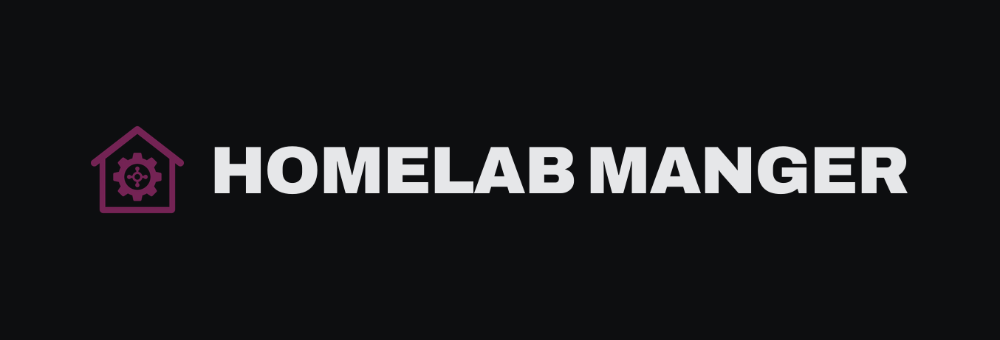
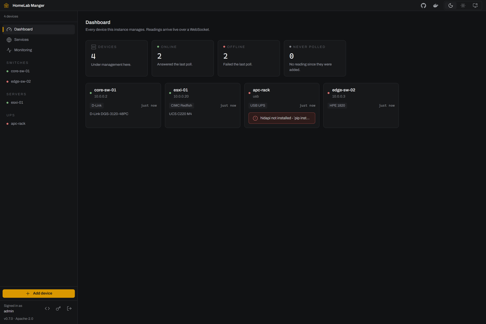
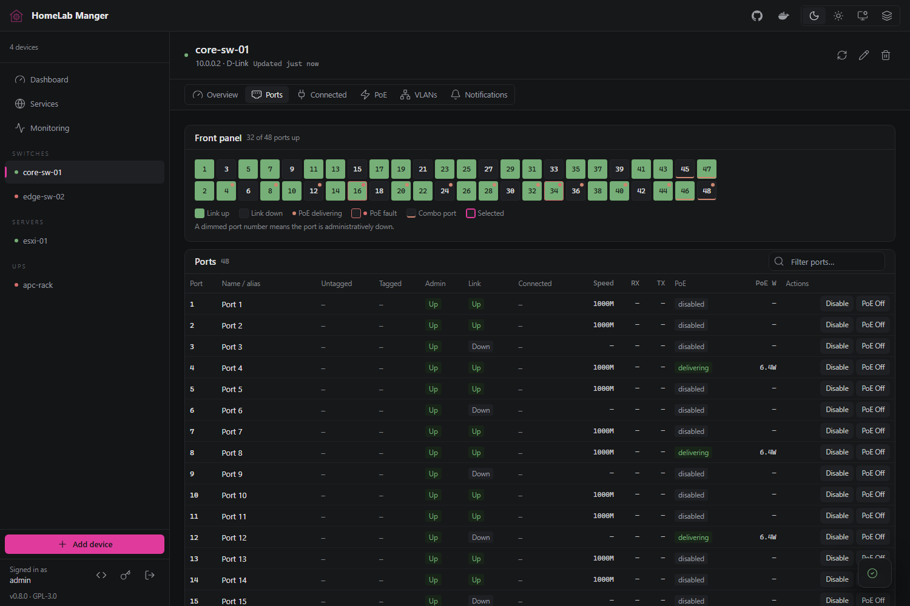
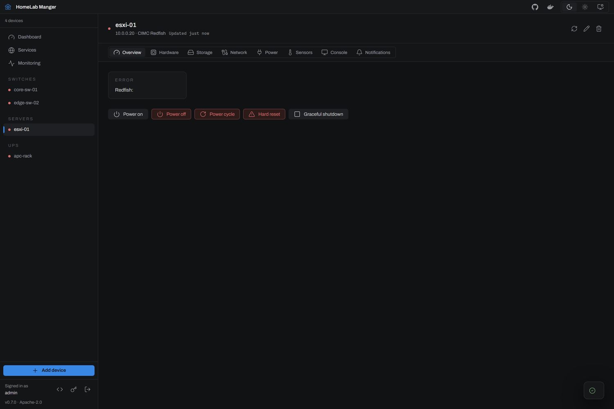
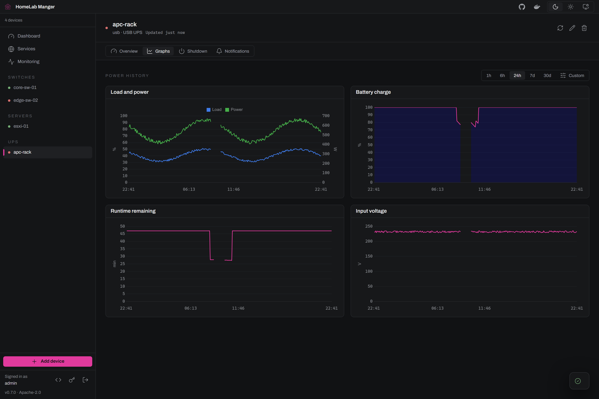
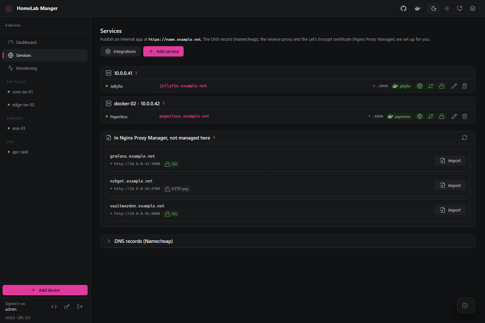

<p align="center">
  <picture>
    <source media="(prefers-color-scheme: dark)" srcset="docs/images/banner.png">
    <source media="(prefers-color-scheme: light)" srcset="docs/images/banner-paper.png">
    
  </picture>
</p>

<p align="center">
  
  
  
</p>

<p align="center">
  One page for <b>the whole rack</b>: switches, servers, BMCs and UPSes, each read over the protocol it already speaks.
</p>

<p align="center">
  SNMP · SSH · Redfish · CIMC XMLAPI · IPMI · USB HID · SQLite · one container, amd64 and arm64
</p>



> Built for a trusted network. Device credentials are encrypted at rest, and
> sign-in is throttled against guessing, but the app is single-user, the
> encryption key sits beside the database, and HTTPS is opt-in. See
> [what is not there yet](#what-is-not-there-yet) before you put it anywhere
> public.

## Install

The container is the supported way to run it. It carries every dependency and
is published for each release to both GitHub Container Registry and Docker Hub.

```yaml
# compose.yaml
services:
  homelab-manger:
    image: ghcr.io/spillebulle/homelab-manger:0.8.0
    ports:
      - "8080:8080"
    environment:
      ADMIN_PASSWORD: pick-something
    volumes:
      - homelab-data:/data
    restart: unless-stopped

volumes:
  homelab-data:
```

`docker compose up -d`, then open <http://localhost:8080> and sign in as
`admin` with the password you set. `0.8.0` is the current release; `:latest`
also exists and moves with every release, so pin a version if you would rather
choose when to upgrade.

The same image is on Docker Hub as `spillebulle/homelab-manger`. To run it
without compose:

```bash
docker run -d --name homelab-manger \
  -p 8080:8080 -e ADMIN_PASSWORD=pick-something \
  -v homelab-data:/data \
  ghcr.io/spillebulle/homelab-manger:0.8.0
```

**Monitoring a USB-connected UPS needs two extra flags**, `--privileged` and
`-v /dev:/dev:ro`, because the adapter reads the UPS through a `/dev/hidrawN`
node that changes when the UPS re-enumerates. Network-only installations do not
need either. To build the image yourself instead of pulling it:

```bash
git clone https://github.com/Spillebulle/homelab-manger.git
cd homelab-manger
docker build -t homelab-manger .
```

The `/data` volume holds the database, the session secret and the
credential-encryption key. Keep it across restarts, or sign-ins and stored
device credentials are lost.

## Switches



D-Link DGS-3120, HPE OfficeConnect 1820 and anything generic enough to answer
IF-MIB. Port status, PoE state and per-port power, VLAN membership, and a
Connected tab listing every learned MAC with its port and its vendor from the
IEEE registry.

Writes go over whichever surface the firmware actually supports, which is not
always SNMP: PoE and VLANs on the DGS-3120 are driven over SSH, and the 1820 is
driven through its web interface, because neither exposes them any other way.

| Adapter | Reads | Writes |
|---|---|---|
| `dlink` | SNMP, SSH | SSH |
| `hpe1820` | SNMP | Web interface |
| `snmp` | SNMP | SNMP |

## Servers and BMCs



HP iLO, Dell iDRAC, Huawei iBMC and Cisco UCS C-series. Inventory down to the
DIMM, live sensors and per-PSU wattage, power actions, and a KVM launch that
downloads the console file the firmware itself generates.

Cisco needs the right adapter for its firmware: `cimc` for anything before 3.0,
`cimc_redfish` for 3.0 and later, which reads sensors far faster and adds BIOS
and BMC detail the older interface never exposed.

| Adapter | For |
|---|---|
| `ilo`, `idrac`, `redfish` | Anything speaking Redfish |
| `ibmc` | Huawei iBMC, which rejects basic authentication |
| `cimc` | UCS C-series, CIMC before 3.0 |
| `cimc_redfish` | UCS C-series, CIMC 3.0 and later |

## UPS and outage orchestration



A USB-connected UPS is read directly over the standard HID power device class,
so most units work without NUT or any per-model configuration. Charge, runtime,
load, watts and input voltage are stored as history and graphed over ranges from
one hour to a custom window.

The Shutdown tab turns that into a plan: pick which machines to bring down, in
what order, at what charge or runtime threshold, and how long to wait between
each. Test plan walks the whole thing and sends the notifications without
powering anything off.

## Publishing services



One form publishes an internal app at `https://name.your-domain`: the DNS record
in Namecheap, the proxy host in Nginx Proxy Manager and the Let's Encrypt
certificate are provisioned in order, with per-step status and a retry that
picks up where it stopped.

Existing proxy hosts can be imported rather than recreated, renaming a service
re-provisions its record and certificate, and a read-only Portainer connection
fills in forward targets and shows each service's container state.

## Monitoring

Devices and published services can be registered as monitors in an external
uptime monitor, with their notification channels and status-page membership
managed from the same page. Kuvasz is the implemented provider. Every part of it
reverses: pause a monitor, clear its channels, take it off a page, or delete it
while leaving the remote monitor alone.

## Events and notifications

Every device keeps a log of what happened to it: went offline, came back, went
on battery, was shut down by the outage plan. Each device can post those to a
Discord webhook, with separate switches for offline, UPS state and shutdown
actions.

## Interface


Dense and quiet: 12 px type, hairline rules, one accent that only ever means
selected, in hand or primary, and semantic colour reserved for state. Numbers are
monospaced so a column lines up and a reading does not jitter as it changes. A
chart draws a real gap where polling stopped rather than interpolating across it.

Dark, light, or follow the system. The interface follows
[the house design principles](docs/ui-conventions.md). The typeface and the icon
set are bundled rather than fetched; Tailwind, Alpine and Chart.js still come
from a CDN, so a machine with no route out gets an unstyled page.

## Themes

A theme is a file. Import one, edit the colours, export it, and hand it to
somebody else. The format is `.umbertheme`, shared with the other apps built to
the same principles, so a theme made here opens there and one made there opens
here.

A file carries 27 colours and everything else is derived from them, which is what
keeps it portable. Graphite and Paper ship built in and are read-only; your own
live in `themes/` beside the database, one ordinary file each. A line that cannot
be read costs that one colour rather than the file, and the app says how many it
skipped.

## What is not there yet

| Not there | Detail |
|---|---|
| More than one user | One account, no roles, no registration, no multi-factor, no password-reset flow. Reset means deleting a row and restarting. |
| Protection on a public network | Only sign-in is rate limited. There is no CORS allowlist and HTTPS is opt-in, so put it behind something if it faces the internet. |
| Key rotation | Changing `CREDENTIAL_KEY` makes existing device credentials unreadable and every device has to be re-entered. |
| Uptime Kuma | It has no management API, only a socket protocol, so it is listed and disabled rather than half-working. |
| Serial-over-USB UPSes | Only the HID power device class is read. Megatec and Voltronic units that answer `Q1` over a serial bridge are not supported. |
| Other DNS and proxy providers | Service publishing is Namecheap and Nginx Proxy Manager only, over HTTP-01. There is no DNS challenge. |
| Running with no internet access | Tailwind, Alpine and Chart.js load from a CDN at runtime. The typeface and icons are bundled, but the page is unstyled without a route out. |
| A theme for the app icon | The interface follows an imported theme, but the favicon and the banner are files baked at build time and keep the app's own colour. |
| Routers and PDUs | Only through the generic SNMP adapter. There is no vendor adapter for either, and no device can be powered off through a PDU. |

## Configuration

These are the ones worth setting on the first run.

| Variable | Default | What it does |
|---|---|---|
| `ADMIN_PASSWORD` | `changeme` | Password for the account created on first start. Read only while there is no account. |
| `SESSION_SECRET` | generated | Signs the session cookie. Generated beside the database if unset. |
| `CREDENTIAL_KEY` | generated | Encrypts stored device credentials. Generated beside the database if unset. |
| `DB_PATH` | `/data/homelab.db` | Where the database lives. Needs setting when running from source. |
| `PORT` | `8080` | Port the container listens on. Publish the matching host port. |

Every variable, and what is set in the interface rather than the environment,
is in [`docs/configuration.md`](docs/configuration.md).

- The HTTP API, its authentication and every endpoint: [`docs/api.md`](docs/api.md).
- Setting up Nginx Proxy Manager, Namecheap, Portainer and Kuvasz: [`docs/integrations/`](docs/integrations).
- Symptoms, causes and fixes, including the per-vendor ones: [`docs/troubleshooting.md`](docs/troubleshooting.md).
- What the interface is made of: [`docs/ui-conventions.md`](docs/ui-conventions.md).

## Building from source

```powershell
git clone https://github.com/Spillebulle/homelab-manger.git
cd homelab-manger
pip install -r requirements.txt
$env:DB_PATH = "$PWD\homelab.db"
uvicorn backend.main:app --reload --host 0.0.0.0 --port 8080
```

One FastAPI process serves the JSON API and the interface. There is no
front-end build step.

## Licence

Apache License 2.0, in [LICENSE](LICENSE). Archivo is bundled under the SIL
Open Font Licence, in [`frontend/static/fonts/OFL.txt`](frontend/static/fonts/OFL.txt).
Icons are Lucide, under the ISC licence.
